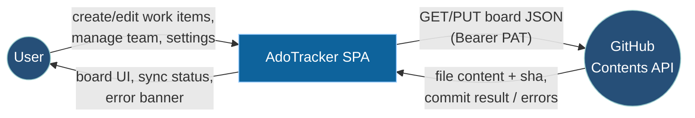
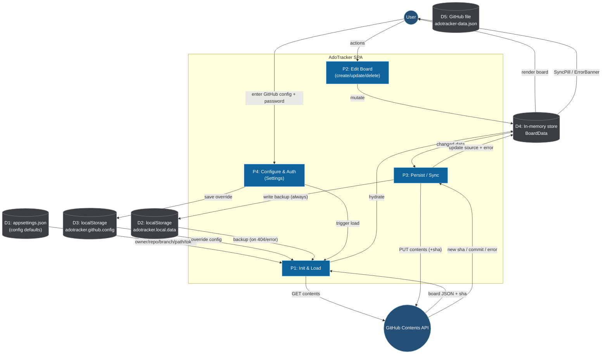
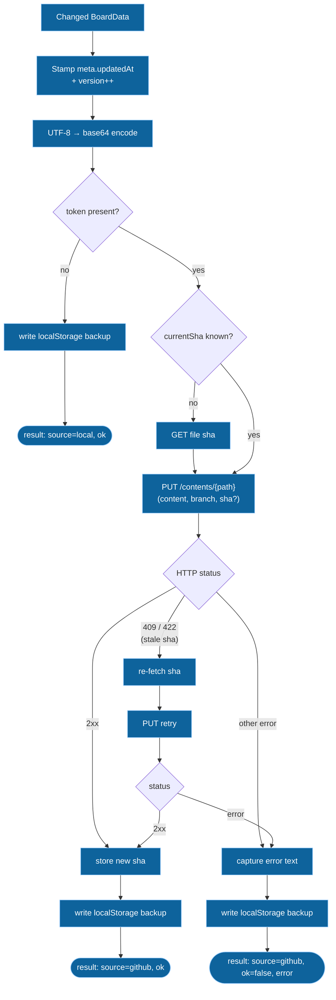

# AdoTracker — Data Flow Diagrams (DFD)

Data-flow view of how board data moves between the user, the SPA, browser storage,
and GitHub. Complements [hld.md](hld.md).

---

## Legend

| Symbol | Meaning |
|--------|---------|
| External Entity | Actor/system outside the app (User, GitHub) |
| Process | Logic that transforms data |
| Data Store | Where data rests (localStorage, GitHub file) |
| →→ | Data flow direction |

---

## Level 0 — Context Diagram

---

## Level 1 — Main Data Flows

---

## Level 2 — Persist / Sync (P3) Detail

Key invariant: **localStorage is written on every terminal path**, so a failed GitHub
push never loses the user's edits.

---

## Data Flow Summary Table

| # | Flow | From | To | Trigger |
|---|------|------|----|---------|
| 1 | Config defaults | `appsettings.json` | Init (P1) | App startup |
| 2 | Config override | localStorage `github.config` | Init (P1) | Startup / after Settings save |
| 3 | Remote read | GitHub file | Init (P1) | `fetchBoard()` |
| 4 | Backup read | localStorage `local.data` | Init (P1) | 404 / error fallback |
| 5 | Hydrate | Init (P1) | In-memory store | After load |
| 6 | Edit | User | Edit (P2) → store | Create/update/delete |
| 7 | Persist trigger | store | Persist (P3) | Debounced (~200ms) |
| 8 | Backup write | Persist (P3) | localStorage `local.data` | Every save attempt |
| 9 | Remote write | Persist (P3) | GitHub file | `saveBoard()` PUT |
| 10 | Sync status | Persist (P3) | User (SyncPill/Banner) | After save |
| 11 | Settings save | User | Configure (P4) | Save & connect |

---

## Storage Keys Reference

| Key | Location | Contents |
|-----|----------|----------|
| `adotracker.github.config` | localStorage | User's GitHub config override |
| `adotracker.local.data` | localStorage | Last-known board JSON (backup) |
| `adotracker.settings.authed` | sessionStorage | Settings auth flag (per session) |
| `github` section | `public/appsettings.json` | Default owner/repo/branch/path/token |
| configured `path` | GitHub repo | Canonical board JSON (source of truth) |
