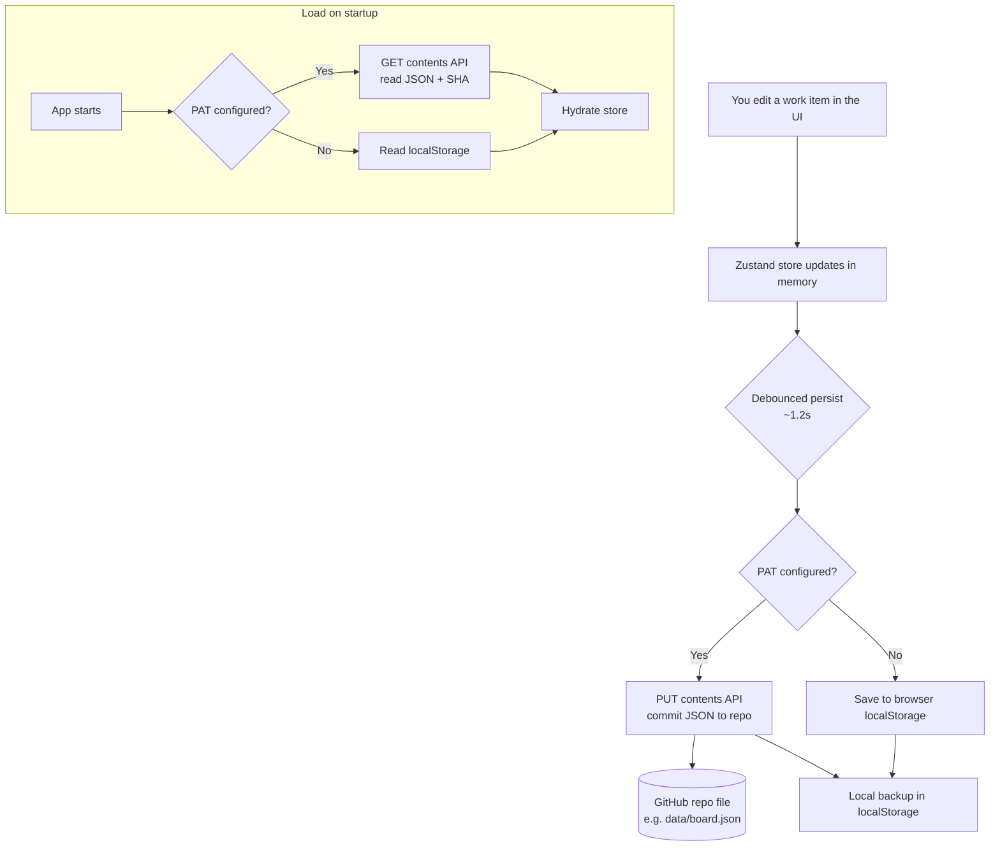

# AdoTracker — GitHub Storage Setup Guide

AdoTracker stores all board data (work items, sprints, team, queries) as a **single JSON file inside a GitHub repository**. GitHub becomes your database. This guide explains the data flow and the exact steps to configure it.

---

## 1. How the data flow works



### Key points
- **One file, one source of truth.** All data lives in a single JSON file (default path you choose, e.g. `data/board.json`).
- **SHA tracking.** Every read stores the file's Git `sha`. The next write sends that `sha` so GitHub can detect conflicts and version the file correctly.
- **Every save is a commit.** Writes use a commit message like `chore(adotracker): update board data (<timestamp>)`, so you get full history in the repo.
- **Debounced writes.** Rapid edits are batched (~1.2s) into a single commit instead of one commit per keystroke.
- **Local backup always.** After every save, a copy is also written to `localStorage` so data is never lost if a push fails or you are offline.
- **No PAT = local-only mode.** Without a token, everything is stored in the browser's `localStorage` only.

---

## 2. What you need

| Item | Description |
|------|-------------|
| A GitHub repository | Can be private or public. Data is committed here. |
| A Personal Access Token (PAT) | Grants the app permission to read/write the file. |
| Repo owner + name | e.g. owner `octocat`, repo `my-boards`. |
| Branch | Usually `main`. |
| File path | Where the JSON lives, e.g. `data/board.json`. |

---

## 3. Create a GitHub repository

1. Go to <https://github.com/new>.
2. Give it a name, e.g. `adotracker-data`.
3. Choose **Private** (recommended) or Public.
4. Click **Create repository**. You can leave it empty — the app creates the file on first save.

---

## 4. Create a Personal Access Token (PAT)

You can use either a **fine-grained** token (recommended) or a **classic** token.

### Option A — Fine-grained token (recommended)
1. Go to <https://github.com/settings/personal-access-tokens/new>.
2. **Token name:** `AdoTracker`.
3. **Expiration:** pick a duration (e.g. 90 days).
4. **Resource owner:** your account (or org).
5. **Repository access:** *Only select repositories* → choose the repo you created.
6. **Permissions → Repository permissions → Contents:** set to **Read and write**.
7. Click **Generate token** and **copy it** (you won't see it again).

### Option B — Classic token
1. Go to <https://github.com/settings/tokens/new>.
2. **Note:** `AdoTracker`.
3. **Scopes:** check **`repo`** (full control of private repositories).
4. Click **Generate token** and copy it.

> Security note: the PAT is stored in your browser's `localStorage` and sent directly to the GitHub API from the browser. Use the least-privilege fine-grained token limited to a single repo. Never commit the token to source control.

---

## 5. Configure AdoTracker

1. Open the app and click the **⚙ Settings** icon.
2. Unlock Settings with the password (`Manage!v@nt!12`).
3. Fill in the GitHub section:

   | Field | Example | Notes |
   |-------|---------|-------|
   | **Owner** | `octocat` | Your GitHub username or org. |
   | **Repository** | `adotracker-data` | Repo name only, no slashes. |
   | **Branch** | `main` | Must already exist. |
   | **Path** | `data/board.json` | File is created automatically if missing. |
   | **Token (PAT)** | `github_pat_...` | Pasted from step 4. |

4. Click **Test connection** to verify the repo/token are valid.
5. Click **Save**. The app now reads from and writes to GitHub.

---

## 6. Verify it works

1. Create or edit a work item.
2. Wait ~2 seconds (debounce) — the sync pill shows a saving/saved state.
3. Open your repo on GitHub → open the file (e.g. `data/board.json`) → check the **commit history**. You should see a new commit `chore(adotracker): update board data (...)`.
4. Refresh the app. The data reloads from GitHub.

---

## 7. Storage keys and file format

- **Config location:** browser `localStorage` key `adotracker.github.config`
- **Local backup location:** browser `localStorage` key `adotracker.local.data`
- **Remote file:** the JSON you configured, e.g. `data/board.json`

The stored JSON shape:

```jsonc
{
  "workItems": [ /* all epics, features, PBIs, bugs, tasks, issues */ ],
  "iterations": [ /* sprints */ ],
  "team": [ /* team members */ ],
  "queries": [ /* saved queries */ ],
  "lastId": 42,
  "meta": { "updatedAt": "2026-09-29T10:00:00.000Z", "version": 7 }
}
```

---

## 8. Troubleshooting

| Symptom | Likely cause | Fix |
|--------|--------------|-----|
| `GitHub 401` | Bad/expired token | Regenerate the PAT and re-save. |
| `GitHub 403` | Token missing Contents write permission | Grant **Contents: Read and write** (fine-grained) or `repo` scope (classic). |
| `GitHub 404` on save | Wrong owner/repo/branch, or branch doesn't exist | Double-check fields; create the branch. |
| `409 conflict` | File changed elsewhere since last read | Refresh the app to re-read the latest `sha`, then edit again. |
| Data only saves locally | No PAT configured | Add a valid token in Settings. |

---

## 9. Deploying on GitHub Pages

The app is a static SPA and can be hosted on GitHub Pages. Because there is no backend, each user configures their **own** PAT in their **own** browser via Settings — the token is never bundled into the deployed site. See the workflow at `.github/workflows/deploy.yml`.
