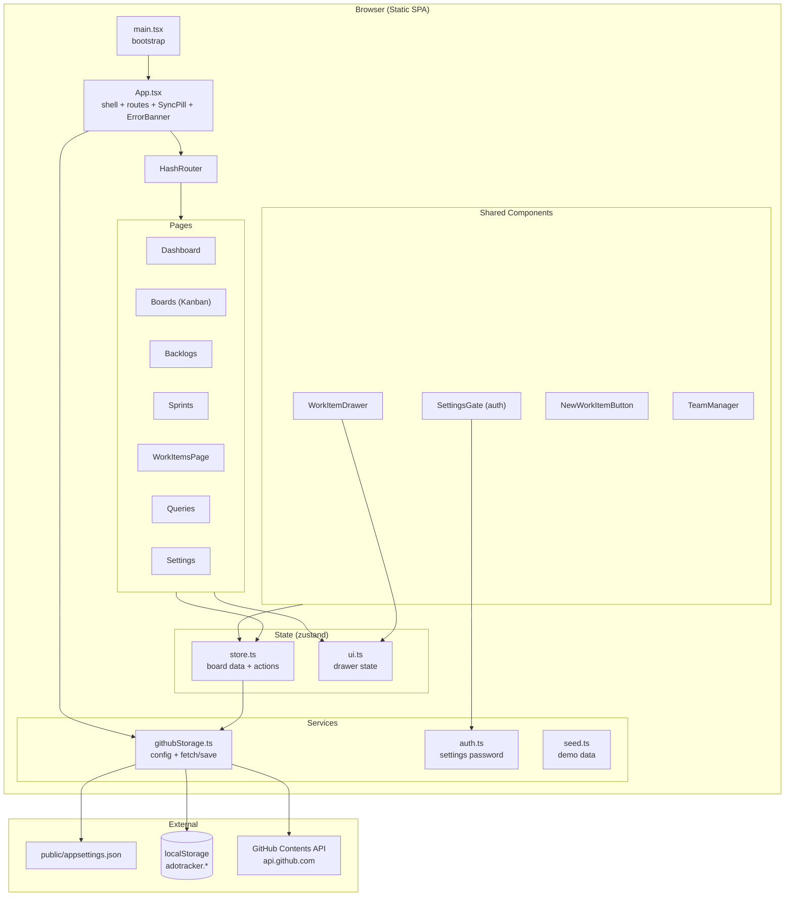
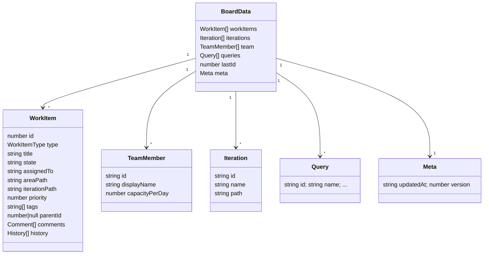
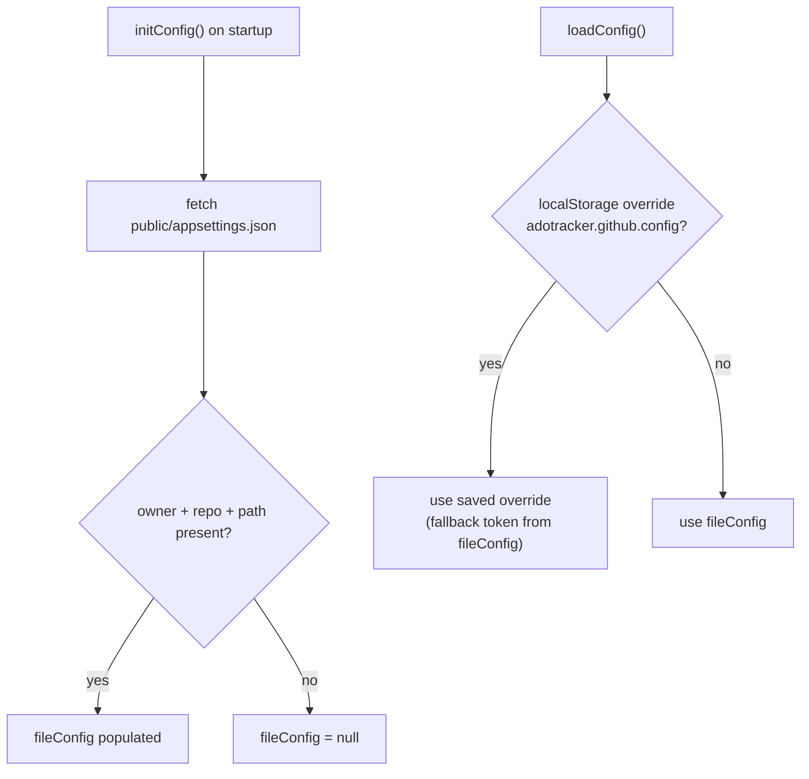
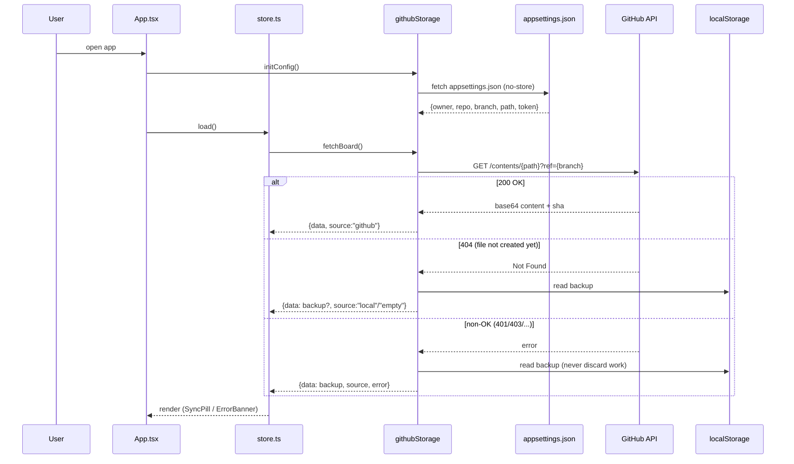
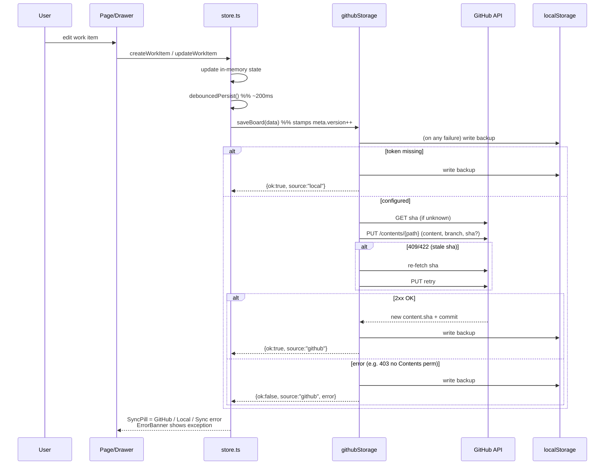
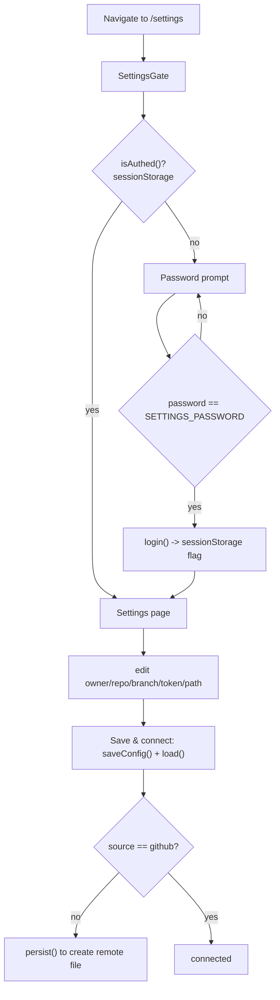
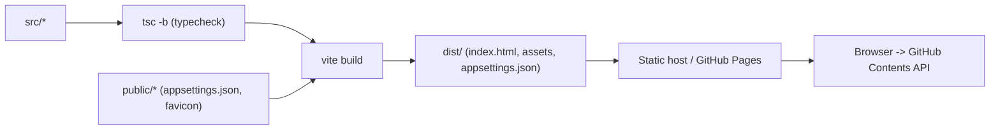

# AdoTracker — High-Level Design (HLD)

An Azure DevOps Boards–style work-item tracker built as a **static single-page app**.
It runs entirely in the browser and persists board data to a **single JSON file in a
GitHub repository** (via the GitHub Contents REST API), with **localStorage** as an
always-on offline backup.

---

## 1. Overview

| Aspect | Choice |
|--------|--------|
| Type | Client-only SPA (no backend server) |
| Framework | React 18 + TypeScript |
| Build tool | Vite 5 |
| Routing | `react-router-dom` **HashRouter** (GitHub Pages friendly) |
| State | **zustand** (`store.ts` = board data, `ui.ts` = drawer/UI) |
| Persistence | GitHub Contents API (primary) + `localStorage` (backup) |
| Config | `public/appsettings.json` (read at runtime) + localStorage override |
| Auth | Client-side password gate for the Settings page only |
| Hosting | Static host / GitHub Pages (`base: "./"`) |

> Note: there is no server. All GitHub calls happen directly from the browser using a
> Personal Access Token (PAT). The PAT is client-visible, so this design targets
> personal/internal use, not multi-tenant security.

---

## 2. Component Architecture

---

## 3. Data Model

The **entire board** is serialized as one JSON document and stored at the configured
path (e.g. `adotracker-data.json`) in the GitHub repo.

---

## 4. Configuration Resolution

`githubStorage.loadConfig()` resolves the active GitHub config in this order:

| Key | Purpose |
|-----|---------|
| `public/appsettings.json` | Default `owner/repo/branch/path/token` shipped with the app |
| `adotracker.github.config` | User override entered in Settings (localStorage) |
| `adotracker.local.data` | Last-known board JSON backup (localStorage) |

---

## 5. Load Flow (startup)

---

## 6. Save Flow (create/update/delete work item)

Writes are **debounced** and always mirror to localStorage so no edit is ever lost.

Key resilience features:
- **SHA tracking** (`currentSha`) so updates to an existing file are accepted; auto
  re-fetch + single retry on `409/422`.
- **localStorage backup on every path** — data is never discarded on a failed push.
- **UTF-8-safe base64** encode/decode for the file content.
- **ErrorBanner** surfaces the raw GitHub exception on the main page.

---

## 7. Settings & Auth Flow

> The settings password is a **client-side gate only** (obfuscation, not real security),
> since all code runs in the browser.

---

## 8. Routing Map

| Route | Page | Notes |
|-------|------|-------|
| `/` | → redirect `/dashboard` | |
| `/dashboard` | Dashboard | overview widgets + TeamManager |
| `/workitems` | WorkItemsPage | flat list |
| `/boards` | Boards | Kanban columns |
| `/backlogs` | Backlogs | hierarchical backlog |
| `/sprints` | Sprints | iteration/capacity view |
| `/queries` | Queries | saved queries |
| `/settings` | Settings (gated) | GitHub config + auth |

HashRouter is used so deep links like `/#/boards` work on static hosts / GitHub Pages
without server-side rewrite rules.

---

## 9. Deployment

- Build: `tsc -b && vite build` → `dist/`.
- `vite.config.ts` sets `base: "./"` for relative asset URLs on Pages.
- `public/appsettings.json` is copied verbatim to `dist/` and served publicly.

> Security caveat: any token placed in `public/appsettings.json` is bundled into `dist`
> and served publicly. For anything beyond personal use, keep the token blank in the
> file and enter it via the Settings screen (localStorage only).

---

## 10. Trust & Security Notes

- The GitHub PAT is client-visible; treat the repo/token as personal scope.
- Least-privilege PAT: **Contents = Read and write** on the single data repo only.
- Private repo is fine; the token just needs the Contents permission (missing it
  returns `403 "Resource not accessible by personal access token"`).
- No secrets should be committed in `appsettings.json` for a public deployment.
